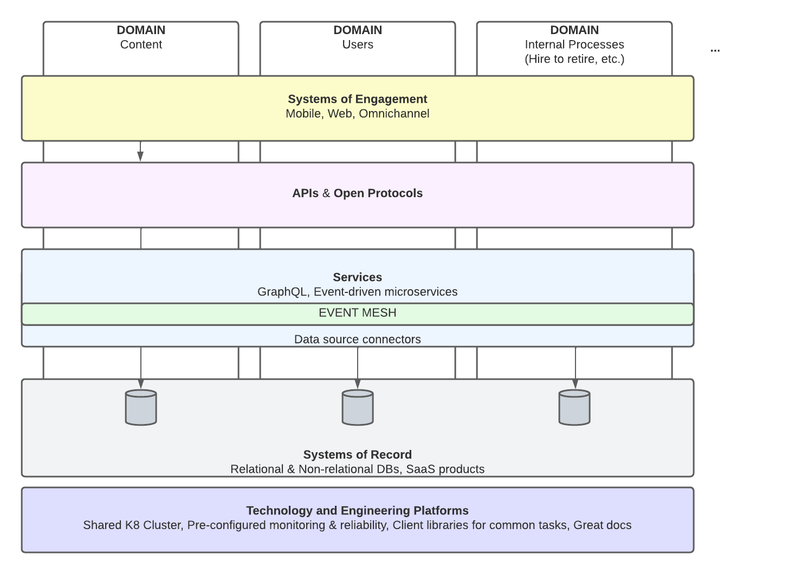

# Waves Infra Demo

This repository contains the Terraform Configuration for a demo that in broad strokes shows how I'd architect a variety of Roca News's services.

## From my POV, this is a sketch of a scalable technology foundation that supports rapid feature delivery

## This is an architecture diagram of the subset of the overall vision that this demo implements

